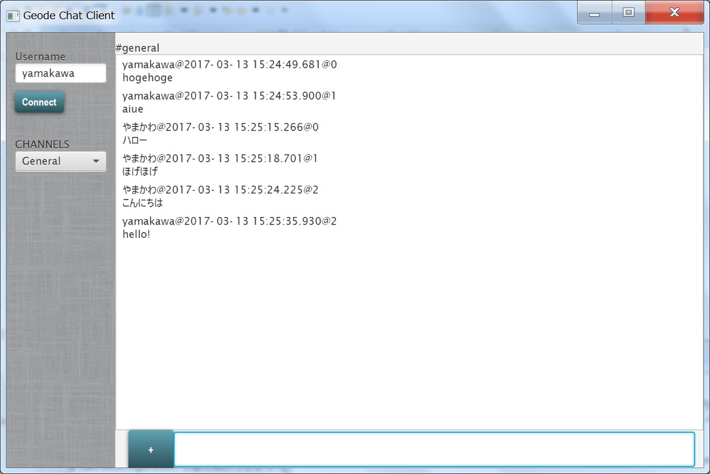

# Apache Geode Tutorial

本チュートリアルでは、簡単なチャットアプリケーションを使用して、Apache Geodeの基本的な使い方を学びます。

GeodeHandsonディレクトリは、このチュートリアルを開始する時点でのJavaプロジェクトです。
チュートリアルが完了したときの完成系がGeodeHandsonFinalとなります。

1. [EmbeddedモードのCUIチャットアプリ作成](embedded.md)
1. [EmbeddedモードのCUIチャットアプリ作成の追加演習](embedded-add.md)
1. [クライアント-サーバ型のCUIチャットアプリ作成](client-server.md)
1. [クライアント-サーバ型のCUIチャットアプリ作成の追加演習](client-server-add.md)
1. [GUIチャットアプリ作成](gui.md)
1. [GUIチャットアプリ作成の追加演習](gui-add.md)

全ての演習が終了したときには、このようなチャットアプリが少ないコード量で出来ています。

